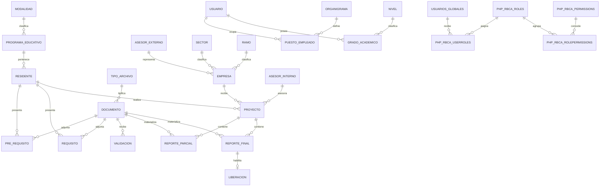

# Análisis de bases de datos y diseño objetivo para la modernización

Fecha: 2026-09-05 · Última actualización: 2026-09-06  
Documento relacionado: [Análisis DDD y migración](./ANALISIS_DDD_MIGRACION.md)

## 1. Propósito y alcance

Este documento incorpora el modelo relacional recuperado de las bases `reposs` y `compartida` al análisis DDD, y define las acciones necesarias para migrar a Laravel + Angular con una API REST.

Fuentes contrastadas:

1. Diagrama PNG recuperado [modelo_relacional_reposs-compartida.png](./assets/modelo_relacional_reposs-compartida.png), incorporado a la documentación.
2. Los modelos y consultas bajo `app/Models/Reposs`, `app/Models/PuestoEmpleado` y `app/Models/Roles`.
3. La migración disponible `2024-11-26-064209_UserTokens.php`.
4. Los controladores y servicios que escriben o eliminan registros relacionados.

El PNG es una fotografía lógica recuperada, no una prueba suficiente del DDL desplegado. Permite confirmar nombres, columnas y relaciones diseñadas, pero no garantiza que las claves foráneas, índices, `ON DELETE`, triggers o restricciones estén realmente instalados. Antes de migrar se requiere un `mysqldump --no-data` de cada ambiente autorizado.

### Cobertura

- **Análisis detallado confirmado por imagen y código:** `reposs` y `compartida`.
- **Análisis derivado principalmente del código:** `laboratorios` e `inventarios`.
- **Pendiente para las cuatro bases:** DDL real, volúmenes, cardinalidades, datos huérfanos, duplicados, triggers, vistas, procedures, events y privilegios.

## 2. Inventario recuperado

El diagrama muestra 31 tablas de negocio principales, además de `user_tokens` y `migrations` representadas de forma colapsada.

| Área | Tabla | Base inferida | Propósito |
|---|---|---|---|
| Residente | `residente` | reposs | Perfil personal y académico del estudiante. |
| Residente | `pre_requisito` | reposs | Asociación de documento previo con residente. |
| Residente | `requisito` | reposs | Asociación de documento requerido con residente. |
| Programa | `programa_educativo` | reposs | Programa/carrera y periodo de vigencia. |
| Programa | `modalidad` | reposs | Modalidad del programa. |
| Proyecto | `proyecto` | reposs | Proyecto de residencia y sus participantes. |
| Proyecto | `asesor_interno` | reposs | Datos del asesor institucional. |
| Empresa | `empresa` | reposs | Empresa colaboradora y titular. |
| Empresa | `asesor_externo` | reposs | Persona asesora perteneciente a la empresa. |
| Empresa | `sector` | reposs | Catálogo de sector. |
| Empresa | `ramo` | reposs | Catálogo de ramo. |
| Reportes | `reporte_parcial` | reposs | Entrega parcial y calificación. |
| Reportes | `reporte_final` | reposs | Entrega final y calificación. |
| Documentos | `documento` | reposs | Metadata/ruta del archivo. |
| Documentos | `tipo_archivo` | reposs | Catálogo de tipos documentales. |
| Documentos | `validacion` | reposs | Decisión y observaciones sobre documento. |
| Cierre | `liberacion` | reposs | Resolución final asociada al reporte final. |
| Documentos | `constancia_asesoria` | reposs | Folio anual y constancia emitida. |
| Publicaciones | `aviso_vacante` | reposs | Avisos, vacantes y vigencia pública. |
| Recursos institucionales | `formatos_institucionales` | compartida | Catálogo de formatos y recursos institucionales. |
| Recursos institucionales | `imagenes_recursos` | compartida | Imágenes/versiones asociadas a un formato. |
| Organización | `usuario` | compartida | Perfil básico del empleado. |
| Organización | `puesto_empleado` | compartida | Puesto vigente/histórico del empleado. |
| Organización | `organigrama` | compartida | Catálogo jerárquico de cargos. |
| Organización | `grado_academico` | compartida | Formación académica del empleado. |
| Organización | `nivel` | compartida | Catálogo de niveles y denominaciones. |
| IAM | `usuarios_globales` | compartida | Identidad Microsoft transversal. |
| IAM | `phpRbca_roles` | compartida | Árbol de roles PHP-RBAC. |
| IAM | `phpRbca_permissions` | compartida | Árbol de permisos PHP-RBAC. |
| IAM | `phpRbca_userroles` | compartida | Asignación usuario–rol. |
| IAM | `phpRbca_rolepermissions` | compartida | Asignación rol–permiso. |

El PNG también representa `user_tokens` y `migrations` de forma colapsada. El código confirma `user_tokens`; no hay un inventario completo de migraciones que reconstruya el resto del esquema.

## 3. Modelo relacional actual reconstruido



Algunas cardinalidades son inferidas a partir de columnas y consultas. Deben verificarse contra `SHOW CREATE TABLE`.

## 4. Hallazgos estructurales

### 4.1 Identidad fragmentada

Existen al menos tres representaciones de persona:

- `usuarios_globales`: identidad Microsoft y `jobTitle`.
- `usuario`: empleado institucional.
- `residente`: estudiante.

La vinculación se realiza principalmente por `principal_name`, no mediante una clave foránea estable. El callback OAuth crea registros en diferentes bases y PHP-RBAC usa `usuarios_globales.idusuario_global` como `UserID`. Esto causa:

- dependencia de un correo mutable como identidad;
- posibilidad de registros duplicados o desconectados;
- transacciones parciales entre bases;
- ambigüedad entre identidad autenticada, empleado y residente;
- dificultad para anonimizar, desactivar o fusionar identidades.

**Decisión objetivo:** `iam_identidades` será la fuente de identidad. `organizacion_empleados` y `residencias_residentes` mantendrán un `id_identidad` lógico único y opcional, nunca el correo como relación. El identificador del proveedor (`sujeto_proveedor`) debe ser único por inquilino.

### 4.2 Proyecto concentra relaciones sin expresar vigencia

`proyecto` relaciona directamente residente, empresa, asesor interno y, según el diagrama, puesto. El asesor externo se obtiene indirectamente desde `empresa.idasesor_externo`. Esto implica que cambiar el asesor principal de una empresa puede alterar retrospectivamente proyectos anteriores.

**Diseño objetivo:** usar asignaciones fechadas:

- `residencias_proyectos`
- `residencias_asesores_internos_proyecto`
- `residencias_asesores_externos_proyecto`

Cada asignación conserva participante, rol, fecha de inicio/fin y snapshot de nombre/cargo si el documento legal debe reproducirse históricamente.

### 4.3 Empresa y asesor externo tienen ownership ambiguo

El modelo actual coloca `idasesor_externo` en `empresa`. Las consultas asumen un asesor por empresa, aunque el lenguaje de negocio permite que una empresa tenga varios contactos y que cada proyecto elija uno.

**Decisión confirmada:** Empresa es un catálogo global institucional y actúa como aggregate root; ContactoEmpresa es hijo y representa, entre otros contactos, a los asesores externos. Una empresa puede tener varios asesores externos y cada proyecto selecciona uno o más mediante asignaciones fechadas, sin duplicar ni privatizar la empresa por residente.

### 4.4 Documento, requisito, reporte y validación duplican relaciones

`pre_requisito` y `requisito` tienen casi la misma estructura. Los reportes guardan `idproyecto` e `iddocumento`. `validacion` guarda `idpuesto` e `iddocumento`, y el diagrama sugiere además `idproyecto`. Esto permite estados contradictorios:

- documento unido a un proyecto distinto del reporte;
- múltiples validaciones sin saber cuál es vigente;
- eliminación manual en tres tablas sin cascada transaccional uniforme;
- reemplazo físico de archivo sin versionado verificable;
- una validación sin identidad global estable del revisor.

**Diseño objetivo:** un agregado de evidencia versionada:

```text
evidence_requirements
  └── evidence_submissions
        ├── stored_files
        └── evidence_reviews (historial; una decisión vigente)
```

`scope_type/scope_id` puede representar expediente, proyecto o liberación, pero es preferible usar tablas explícitas si se necesitan claves foráneas estrictas. Parcial y final deben ser tipos de entrega del seguimiento, no duplicaciones completas de estructura.

### 4.5 Liberación depende indirectamente del proyecto

`liberacion` apunta a `reporte_final`; el proyecto y residente se deducen mediante joins. Esto expresa correctamente que el reporte final es un requisito, pero no protege por sí solo:

- una única liberación por proyecto;
- que el reporte final esté aprobado;
- que todos los demás requisitos estén aprobados;
- la identidad estable de quien resolvió;
- historial de cambios de resolución.

**Diseño objetivo:** `residencias_liberaciones` referencia directamente `id_proyecto`, `id_reporte_final`, `id_identidad_resolutor`, estado, fechas de auditoría y versión. Restricciones y servicio de dominio verifican la elegibilidad.

### 4.6 Datos históricos desnormalizados

`asesor_interno` almacena `principal_name`, puesto, grado y nombre; `empresa` almacena datos del titular; `usuarios_globales` repite `jobTitle`. Parte de esta duplicación puede ser intencional para conservar documentos históricos, pero no está identificada como snapshot.

**Decisión confirmada:** distinguir explícitamente:

- datos maestros normalizados (`employee_id`, `company_contact_id`);
- snapshots legales inmutables (`adviser_name_snapshot`, `position_snapshot`) creados al emitir el documento;
- read models derivados para reportes.

La instantánea de emisión debe incluir en `datos_emision` todos los valores efectivamente consultados y renderizados por el modelo, controlador y vista del formato, además de plantilla, versión, emisor, fecha y hash. Cambios posteriores en datos maestros no modifican una carta o constancia ya emitida.

### 4.7 Integridad temporal insuficiente

Hay combinaciones de `DATETIME`, `DATE`, `TIMESTAMP`, campos `fecha_inicio/fecha_fin`, `fecha_entrega/actualizacion` y soft delete solo en `aviso_vacante`. No se observa convención única de zona horaria, auditoría o vigencia.

**Decisión objetivo:** almacenar instantes en UTC (`timestamp`/`datetime(6)` según estándar acordado), fechas civiles como `date`, y mostrar `America/Mexico_City`. Todas las tablas transaccionales deben tener `created_at`, `updated_at`, actor y, cuando aplique, `deleted_at`/versión.

### 4.8 RBAC legacy y sensibilidad a mayúsculas

Las tablas `phpRbca_*` usan nested sets (`Lft`, `Rght`) y tablas puente cuya PK compuesta no es visible. La mezcla de `phpRbca` puede fallar al trasladar MySQL desde Windows a Linux con `lower_case_table_names` diferente.

**Decisión objetivo:** no replicar físicamente PHP-RBAC. Mapear permisos legacy a abilities estables (`residencies.evidence.review`, `inventories.items.update`) y migrar asignaciones a tablas IAM normalizadas. Durante convivencia, un `LegacyRbacAdapter` traduce nombres.

### 4.9 Claves, índices y constraints no demostrados

El PNG muestra relaciones visuales, pero no los nombres ni acciones de las FK. El código borra manualmente dependencias, lo que sugiere que faltan cascadas o no se confía en ellas. También se observan claves primarias incorrectas en modelos para tablas puente (`UserID` y `RoleID` individuales).

Acciones mínimas:

- PK compuesta o surrogate + `UNIQUE` en tablas puente;
- índices para todas las FK y filtros frecuentes;
- `UNIQUE` para número de control, correo normalizado, Microsoft OID, claves de catálogo, folios e identidades de archivo;
- restricciones de rango/estado y reglas de nulabilidad;
- política explícita `RESTRICT`, `CASCADE` o soft delete por relación.

## 5. Discrepancias entre diagrama y código

| Evidencia | Hallazgo | Acción |
|---|---|---|
| El PNG muestra estructura base; el código contiene `aviso_vacante`, constancias, formatos e imágenes | El esquema evolucionó después del diseño original. | Tratar el PNG como baseline histórico, no fuente única. |
| Solo existe una migración de aplicación visible para `user_tokens` | El esquema completo no es reproducible. | Generar baseline DDL versionado sin ejecutar `CREATE` sobre producción. |
| `ReporteParcialModel` declara PK `id`, mientras el PNG usa `idreporte_parcial` | Posible desalineación modelo–tabla o cambio no documentado. | Verificar con `SHOW CREATE TABLE reporte_parcial` y corregir antes de migrar. |
| `TipoArchivoModel` no declara `DBGroup`, aunque pertenece a `reposs` | Depende accidentalmente del grupo por defecto. | Declarar conexión explícita ahora; repository dedicado en Laravel. |
| Código usa `usuarios_globales.microsoft_ID`; el diagrama confirma esa columna | Identificador externo sin tenant explícito y casing inconsistente. | Migrar a `provider_subject` + `tenant_id`, ambos normalizados. |
| Consultas usan nombres totalmente cualificados y otras no | Dependencia de conexión/default schema. | Inventariar toda query SQL y eliminar resolución implícita. |
| Servicio de documentos de laboratorio crea tabla en runtime | DDL fuera de migraciones. | Capturar el DDL, crear migración y retirar auto-instalación. |
| Configuración tiene cuatro grupos DB con el mismo usuario | Privilegios amplios y acoplamiento operativo. | Usuario DB por aplicación/contexto con mínimo privilegio. |

## 6. Modelo objetivo recomendado

### 6.1 ¿Adaptar o construir una base nueva?

Se recomienda **construir una base nueva para el modelo objetivo** y migrar progresivamente. No se recomienda transformar las tablas actuales in-place como estrategia principal.

Motivos:

1. No existe historial DDL confiable.
2. Las fronteras actuales siguen bases técnicas, no bounded contexts.
3. Identidad y relaciones usan correo o IDs con significado implícito.
4. Varias asociaciones y estados admiten contradicciones.
5. Laravel no debe heredar nombres, PK y convenciones inconsistentes.
6. El strangler requiere rollback y comparación; una base nueva permite carga repetible y reconciliación.

Esto no significa copiar todos los datos de inmediato. Durante la transición, Laravel puede leer tablas legacy mediante adapters; cada agregado cambia de propietario en una ventana controlada.

### 6.2 Topología física

Para el **modular monolith** inicial se recomienda una sola instancia MySQL y una base lógica nueva, por ejemplo `servicios_moderno`, con ownership de tablas por módulo. Esto permite transacciones locales y operación LAMP sencilla. Los módulos no deben acceder a modelos Eloquent de otros módulos aunque compartan motor.

Convención propuesta:

```text
iam_*              Identidad y acceso
organizacion_*     Organización
residencias_*      Residencias
planificacion_*    Planificación de laboratorios
laboratorios_*     Solicitudes de laboratorio
inventario_*       Inventarios
publicaciones_*    Avisos
compartido_*       bandeja de salida, archivos y auditoría técnica
```

Si en el futuro un contexto requiere despliegue independiente, sus tablas ya tendrán dueño y podrán moverse. Separar ahora en seis servidores/bases elevaría el costo sin aportar valor suficiente.

### 6.3 Reglas de frontera

- No usar FK física entre bounded contexts; usar IDs lógicos y snapshots/proyecciones.
- Sí usar FK, `UNIQUE`, `CHECK` e índices dentro de cada contexto.
- No compartir tablas Eloquent entre módulos.
- No hacer joins cross-context en comandos. Los reportes usan proyecciones/read models.
- Toda integración asíncrona usa outbox transaccional.
- Toda mutación crítica guarda actor, fecha, correlation ID y versión.

### 6.4 Tablas objetivo por contexto

| Contexto | Tablas objetivo iniciales | Cambio principal |
|---|---|---|
| IAM | `iam_identidades`, `iam_cuentas_externas`, `iam_roles`, `iam_permisos`, `iam_identidad_roles`, `iam_rol_permisos` | Una identidad estable; OIDC separado de perfil. |
| Organización | `organizacion_empleados`, `organizacion_unidades`, `organizacion_asignaciones_puesto`, `organizacion_grados_academicos`, `organizacion_niveles_academicos` | Puestos 0..n con vigencia, orden y cadena de origen Microsoft; referencias a identidad. |
| Residencias | `residencias_residentes`, `residencias_programas_educativos`, `residencias_modalidades`, `residencias_periodos`, `residencias_empresas`, `residencias_contactos_empresa`, `residencias_proyectos`, tablas de asignación de asesores | Empresa global, relaciones históricas y máximo un proyecto por residente y periodo. |
| Evidencias | `residencias_definiciones_requisito`, `residencias_entregas_evidencia`, `residencias_revisiones_evidencia`, `residencias_reportes_avance`, `compartido_archivos_almacenados` | Entregas tipadas/versionadas, revisiones ilimitadas y cantidad de reportes gobernada por periodo. |
| Cierre y emisión | `residencias_liberaciones`, `residencias_historial_liberaciones`, `residencias_documentos_emitidos`, `residencias_constancias` | Reapertura auditable, última decisión materializada y snapshots documentales inmutables. |
| Publicaciones | `publicaciones_avisos`, `publicaciones_recursos_aviso` | Estados y vigencias explícitas. |
| Planificación | `planificacion_semestres`, `planificacion_laboratorios`, `planificacion_horarios`, `planificacion_dias_inhabiles`, catálogos curriculares | Dueño del calendario y capacidad. |
| Solicitudes | `laboratorios_solicitudes`, tablas de detalle por tipo, `laboratorios_decisiones_solicitud` | Máquina de estados y decisiones auditadas. |
| Inventarios | `inventario_articulos`, detalles por tipo, `inventario_ubicaciones`, `inventario_movimientos`, `inventario_incidencias`, `inventario_cortes_mensuales`, `inventario_detalles_corte_mensual` | Raíz tipada, libro de movimientos e instantáneas inmutables. |
| Plataforma | `compartido_mensajes_salida`, `compartido_claves_idempotencia`, `compartido_registros_auditoria`, `compartido_politicas_retencion`, `compartido_registros_retencion`, `migracion_mapa_ids` | Migración, eventos, trazabilidad y ciclo de vida 2/5/10 sin depuración automática. |

### 6.5 Claves y tipos

- Nuevas PK: ULID binario/char o `BIGINT UNSIGNED`; elegir una sola convención. Para interoperabilidad y orden temporal, ULID es recomendable.
- Mantener `legacy_id` y `legacy_source` con `UNIQUE` durante migración, o centralizar en `legacy_id_map`.
- Correos: `VARCHAR(254)`, normalizados a minúsculas; no usarlos como PK.
- Número de control: string, no número; `UNIQUE` con collation definida.
- RFC/CURP: value objects normalizados, cifrado o tokenización si la evaluación legal lo exige; índices solo cuando sean necesarios.
- Teléfono, código postal y seguro social permanecen strings.
- Estados: `VARCHAR` con `CHECK` o tablas de transición; evitar ENUM de MySQL si se prevén cambios frecuentes.
- Cantidades de inventario: `DECIMAL`, nunca float.
- Archivos: ruta/clave de storage, SHA-256, tamaño, MIME detectado, nombre original y estado de escaneo.
- Tokens OAuth: preferir no persistir access tokens; si se requiere refresh token, cifrado con rotación de llaves y acceso mínimo.

## 7. Acciones requeridas sobre las bases actuales

### Prioridad 0 — seguridad y preservación

1. Rotar las credenciales MySQL versionadas y usar secretos de entorno.
2. Crear usuarios distintos de lectura/migración y runtime con mínimo privilegio.
3. Tomar backups consistentes y probar restauración antes de ejecutar cualquier análisis correctivo.
4. Conservar el checksum del PNG incorporado como evidencia histórica y verificarlo cuando se traslade o publique la documentación.
5. Prohibir cambios DDL manuales sin migración desde este punto.

### Prioridad 1 — recuperar la verdad física

Ejecutar en cada ambiente autorizado:

```sql
SELECT VERSION(), @@sql_mode, @@lower_case_table_names, @@time_zone;
SHOW DATABASES;
SHOW FULL TABLES FROM reposs;
SHOW FULL TABLES FROM compartida;
SHOW FULL TABLES FROM laboratorios;
SHOW FULL TABLES FROM inventarios;
```

Exportar metadatos:

```text
mysqldump --no-data --routines --triggers --events reposs
mysqldump --no-data --routines --triggers --events compartida
mysqldump --no-data --routines --triggers --events laboratorios
mysqldump --no-data --routines --triggers --events inventarios
```

Además, capturar `information_schema.TABLES`, `COLUMNS`, `STATISTICS`, `TABLE_CONSTRAINTS`, `KEY_COLUMN_USAGE`, `REFERENTIAL_CONSTRAINTS` y privilegios. Los dumps deben revisarse para no incluir secretos ni definers sensibles antes de versionarse.

### Prioridad 2 — perfilado de datos

Ejecutar consultas read-only para cuantificar:

- filas por tabla y crecimiento mensual;
- nulos por columna obligatoria;
- duplicados de `principal_name`, `numero_control`, Microsoft ID, RFC y folios;
- huérfanos en todas las relaciones;
- proyectos sin residente/empresa y proyectos duplicados activos;
- documentos sin archivo físico y archivos sin metadata;
- múltiples validaciones sin secuencia determinista o sin una última decisión identificable;
- reportes cuyo proyecto difiere de la validación o liberación;
- cadenas `jobTitle` que no puedan descomponerse de forma determinista en cero o más puestos vigentes;
- programas/semestres con vigencias solapadas;
- roles/permisos duplicados y asignaciones sin padre;
- inventario con detalle inexistente o con más de un subtipo;
- ubicaciones cíclicas o pertenecientes a otro laboratorio;
- cortes duplicados por laboratorio/periodo.

Ejemplos de controles iniciales:

```sql
-- Identidades duplicadas por correo normalizado
SELECT LOWER(TRIM(principal_name)) correo, COUNT(*) cantidad
FROM compartida.usuarios_globales
GROUP BY LOWER(TRIM(principal_name)) HAVING COUNT(*) > 1;

-- Perfilado de puestos vigentes; varios puestos son válidos y deben conservarse
SELECT idusuario, GROUP_CONCAT(nombre_puesto ORDER BY idpuesto SEPARATOR ' / ') puestos_vigentes
FROM compartida.puesto_empleado
WHERE fecha_fin IS NULL
GROUP BY idusuario;

-- Proyectos huérfanos
SELECT p.idproyecto
FROM reposs.proyecto p
LEFT JOIN reposs.residente r ON r.idresidente = p.idresidente
WHERE r.idresidente IS NULL;

-- Documentos sin vínculo funcional
SELECT d.iddocumento
FROM reposs.documento d
LEFT JOIN reposs.pre_requisito pre ON pre.iddocumento = d.iddocumento
LEFT JOIN reposs.requisito req ON req.iddocumento = d.iddocumento
LEFT JOIN reposs.reporte_parcial rp ON rp.iddocumento = d.iddocumento
LEFT JOIN reposs.reporte_final rf ON rf.iddocumento = d.iddocumento
WHERE pre.iddocumento IS NULL AND req.iddocumento IS NULL
  AND rp.iddocumento IS NULL AND rf.iddocumento IS NULL;

-- Asignaciones RBAC duplicadas
SELECT UserID, RoleID, COUNT(*) cantidad
FROM compartida.phpRbca_userroles
GROUP BY UserID, RoleID HAVING COUNT(*) > 1;
```

Estas consultas deben ajustarse al DDL real y ejecutarse primero sobre una copia anonimizada.

### Prioridad 3 — baseline y gobierno

1. Generar `database/legacy-schema/` con DDL exacto y documentación de origen/fecha.
2. Crear un diccionario de datos con owner de negocio, sensibilidad, nulabilidad real y regla de retención.
3. Documentar cada FK, incluso las relaciones lógicas por correo.
4. Crear una matriz de clasificación: pública, interna, confidencial y dato personal.
5. Definir RPO/RTO, backups, restauración y retención de documentos.
6. Agregar CI para validar migraciones Laravel desde cero y `migrate:fresh` sobre una base vacía.

### Prioridad 4 — saneamiento previo

No corregir datos directamente sin reglas acordadas. Para cada anomalía:

1. producir reporte reproducible;
2. asignar owner de negocio;
3. definir regla de supervivencia/merge;
4. crear script idempotente;
5. ensayar en clon anonimizado;
6. guardar conteos antes/después y aprobación;
7. ejecutar con backup y rollback.

Orden sugerido: identidades → catálogos → empleados/puestos → residentes → empresas/contactos → proyectos/asesores → documentos/reportes/validaciones → liberaciones → IAM → laboratorios/inventarios.

## 8. Estrategia de migración de datos

### 8.1 Patrón recomendado

Usar **expand–migrate–contract** con carga repetible:

```text
Legacy MySQL
   │ extract + normalize
   ▼
Staging tables / migration pipeline
   │ validate + map legacy IDs
   ▼
New Laravel-owned tables
   │ reconcile counts, hashes, invariants
   ▼
Cut over writes by aggregate
   │ observation window
   ▼
Retire legacy write path
```

No usar Eloquent seeders como ETL principal. Crear comandos Laravel idempotentes por contexto, con checkpoints, lotes, `legacy_id`, métricas y dead-letter records para filas rechazadas.

### 8.2 Oleadas

| Oleada | Datos | Estrategia de convivencia | Validación |
|---|---|---|---|
| 1 | Catálogos, modalidades, sectores, ramos, niveles | Copia completa repetible; legacy sigue owner | Conteo + hash lógico. |
| 2 | Identidades, empleados, puestos, grados | Shadow read; vinculación por OID/correo controlada | Duplicados, vigencias y roles. |
| 3 | Residentes, empresas y contactos | Laravel lee nuevo; legacy aún escribe hasta corte | Mapeo 1:1 y reglas de merge. |
| 4 | Proyectos y asignaciones de asesores | Ventana de freeze corta o CDC/outbox temporal | Relaciones, fechas y estados. |
| 5 | Archivos, evidencias, reportes y validaciones | Copiar metadata y binarios con SHA-256; no cambiar rutas hasta verificar | Conteo, checksum, permisos y muestra visual. |
| 6 | Liberaciones, constancias y avisos | Corte por vertical slice | Folios únicos y estado público. |
| 7 | Planificación y solicitudes Labs | Carga histórica + corte de escrituras coordinado | Replay de disponibilidad y conflictos. |
| 8 | Inventarios y cortes | Snapshot por laboratorio; congelar movimientos durante corte o usar ledger/CDC | Saldos, subtipos, ubicaciones y cierre. |

### 8.3 Reconciliación obligatoria

Cada ejecución genera:

- cantidad leída, aceptada, transformada, rechazada y ya migrada;
- correspondencia `legacy_id → new_id`;
- hash por entidad con campos normalizados;
- huérfanos/duplicados detectados;
- duración y checkpoint;
- diferencias por regla de negocio;
- firma/aprobación para el cutover.

Para documentos se valida existencia, tamaño y SHA-256. Para inventarios se concilian cantidades y valor/categoría por laboratorio. Para solicitudes se comparan intervalos y estado. Para residencias se concilia el expediente completo, no solo filas aisladas.

### 8.4 Rollback

- Antes del corte: descartar tablas nuevas y repetir carga.
- Durante el corte: mantener legacy read-only y registrar comandos en outbox.
- Después del corte: rollback de aplicación solo si puede reproducir los comandos en legacy; de lo contrario restaurar snapshot y aplicar log validado.
- Nunca permitir escrituras independientes en ambos modelos para el mismo agregado.

## 9. Cambios requeridos en Laravel

- Una conexión `legacy_*` de solo lectura por base durante transición.
- Una conexión principal de escritura para `servicios_moderno`.
- Repositories legacy como Anti-Corruption Layer; ningún controller los usa directamente.
- Migraciones Laravel completas, reversibles cuando sea seguro, con índices y constraints nombrados.
- Commands de ETL versionados y tests con fixtures anonimizados.
- Domain services para transiciones; constraints DB como última línea de defensa.
- Outbox transaccional y handlers idempotentes.
- Policies con `identity_id` y permisos contextuales por laboratorio/residencia.
- API Resources que no expongan columnas o IDs legacy.
- Observabilidad de consultas lentas, locks, deadlocks, pool y lag de migración.

## 10. Índices objetivo iniciales

El diseño definitivo depende del DDL y `EXPLAIN`, pero deben contemplarse:

- `iam_cuentas_externas(proveedor, id_inquilino, sujeto_proveedor)` único.
- `iam_identidades(correo_normalizado)` único condicionado a política institucional.
- `residencias_residentes(numero_control)` único.
- `residencias_proyectos(id_residente, id_periodo)` único; además, índice por estado y fechas. Los solapamientos entre periodos distintos se rechazan en el dominio dentro de una transacción.
- `residencias_entregas_evidencia(id_requisito, id_alcance, numero_version)` único.
- `residencias_revisiones_evidencia(id_entrega, creado_en)`.
- `organizacion_asignaciones_puesto(id_empleado, fecha_fin)` y orden de origen; no imponer unicidad de puesto vigente porque un empleado admite 0..n puestos concurrentes.
- `laboratorios_solicitudes(id_laboratorio, inicio_en, fin_en, estado)` para búsqueda de conflictos.
- `inventario_articulos(id_inventario, tipo_articulo, estado)`.
- `inventario_ubicaciones(id_inventario, id_padre, nombre_normalizado)` único entre hermanos.
- `inventario_cortes_mensuales(id_inventario, periodo)` único.
- todas las FK locales con índice explícito.

Las búsquedas de intervalos no quedan resueltas solo con un índice compuesto; deben revisarse planes, cardinalidad y estrategia de locking para evitar doble reserva.

## 11. Calidad, seguridad y cumplimiento

- Cifrar backups y conexiones TLS; no asumir que red interna equivale a confianza.
- Minimizar datos personales: domicilio, CURP, seguro social y teléfonos requieren finalidad/retención definidas.
- Separar documentos públicos de expedientes privados en buckets/rutas y credenciales diferentes.
- Validar MIME por contenido, límites de tamaño, nombre generado, malware scanning y descarga con autorización.
- No registrar tokens, CURP, RFC ni documentos en logs.
- Auditar lectura y mutación de expedientes sensibles.
- Establecer borrado/anonimización legal sin destruir constancias que deban conservarse.
- Probar restauración, point-in-time recovery y continuidad del almacenamiento de archivos junto con la DB.

## 12. Criterios de aceptación de la modernización de datos

La base nueva puede considerarse lista cuando:

1. se crea desde cero únicamente con migraciones versionadas;
2. todas las tablas tienen owner de contexto y diccionario;
3. no hay credenciales en el repositorio;
4. PK, FK locales, índices, uniques y checks están probados;
5. las cargas son idempotentes y reanudables;
6. la reconciliación alcanza 100% o cada excepción está aprobada;
7. archivos y metadata coinciden por checksum;
8. permisos efectivos coinciden con una matriz aprobada;
9. no existen dual-writes no controlados;
10. rollback, restauración y cutover fueron ensayados;
11. consultas críticas cumplen SLO con datos de volumen realista;
12. CodeIgniter queda read-only antes de su retiro definitivo.

## 13. Decisiones confirmadas con negocio y operación

| # | Decisión confirmada | Consecuencia en el modelo y la operación |
|---:|---|---|
| 1 | Las empresas son globales. Una empresa puede tener varios asesores externos. | `residencias_empresas` no pertenece a un residente; los asesores se modelan en `residencias_contactos_empresa` y se vinculan históricamente a proyectos. RFC normalizado sirve para detectar duplicados, sujeto a excepciones documentadas. |
| 2 | Un residente tiene como máximo un proyecto por periodo, pero puede conservar proyectos históricos de otros periodos en casos excepcionales. | `residencias_periodos` es explícita y existe `UNIQUE (id_residente, id_periodo)`. El agregado rechaza proyectos simultáneos con fechas solapadas, aun si pertenecen a periodos distintos; el histórico nunca se sobrescribe. |
| 3 | Periodos de 5 o 6 meses exigen 3 reportes parciales y 1 final; periodos de 4 meses, 2 parciales y 1 final. | El periodo guarda duración y cantidades requeridas con `CHECK`. El servicio de seguimiento valida numeración, completitud y aprobación antes del reporte final/liberación. Una excepción futura requiere una configuración versionada, no un condicional disperso. |
| 4 | Las validaciones documentales y de liberación pueden reabrirse indefinidamente; debe conservarse todo el historial y la decisión vigente es el último cambio. | Cada revisión documental tiene número secuencial y estado anterior/nuevo; `residencias_historial_liberaciones` conserva cada transición. El estado actual permanece materializado en entrega/liberación y se actualiza atómicamente junto con el historial y outbox. |
| 5 | Cartas y constancias reflejan exactamente los datos existentes al emitirse. | `residencias_documentos_emitidos.datos_emision` guarda un snapshot JSON inmutable, más plantilla/versionado, archivo, emisor, fecha y SHA-256. Se debe levantar una matriz consulta–campo–plantilla desde modelos, controladores y vistas antes de migrar cada formato. |
| 6 | Un empleado puede tener cero, uno o varios puestos vigentes, derivados de Microsoft `JobTitle` (`Puesto 1 / Puesto 2 / ...`). | No existe restricción de un solo puesto activo. Cada asignación conserva cadena fuente, origen, posición y vigencia. El adaptador de Microsoft debe tolerar nulo/cadena vacía, recortar segmentos y registrar anomalías sin inventar puestos. |
| 7 | Archivo circular desde 2 años, histórico desde 5 y depurable desde 10; por defecto no se elimina y queda inactivo para consulta/estadística. | Políticas 24/60/120 meses parametrizadas, estados `ACTIVO`, `CIRCULAR`, `HISTORICO`, `DEPURABLE` y `DEPURADO`, bloqueo legal y trazabilidad. La depuración exige método explícito, autorización, simulación, respaldo y auditoría; `depuracion_automatica = FALSE`. |
| 8 | No existen consumidores externos con acceso directo a tablas; administración solo consulta roles y permisos. | El corte puede hacerse por API/módulo sin contrato SQL externo. Antes del go-live se verifican grants y logs de consultas; el nuevo panel consume la API IAM y no tablas compartidas. |
| 9 | Los servidores institucionales contienen la versión productiva autoritativa; el nuevo desarrollo se realiza en equipos personales/de desarrollo. | Producción es source of truth para extracción. Solo se usan copias anonimizadas en desarrollo, con manifiesto de origen/fecha/checksum; nunca hay sincronización inversa desde desarrollo a producción. |
| 10 | No existen triggers, procedimientos almacenados ni vistas. | No hay reglas ocultas conocidas en esos objetos. El esquema objetivo mantiene reglas en dominio/aplicación y usa PK/FK/UNIQUE/CHECK como defensa; no se incorporan triggers. Se confirma de nuevo con `information_schema` antes del corte. |

Estas decisiones quedan incorporadas al ER y al script base. Aún deben validarse contra el DDL físico y el perfilado de datos de producción: una decisión de negocio confirmada no demuestra que los datos legacy ya la cumplan.
