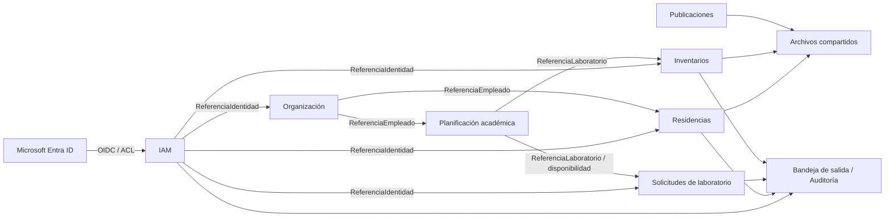
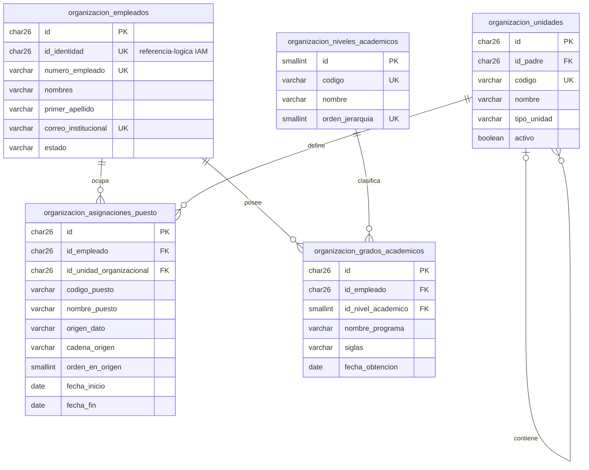
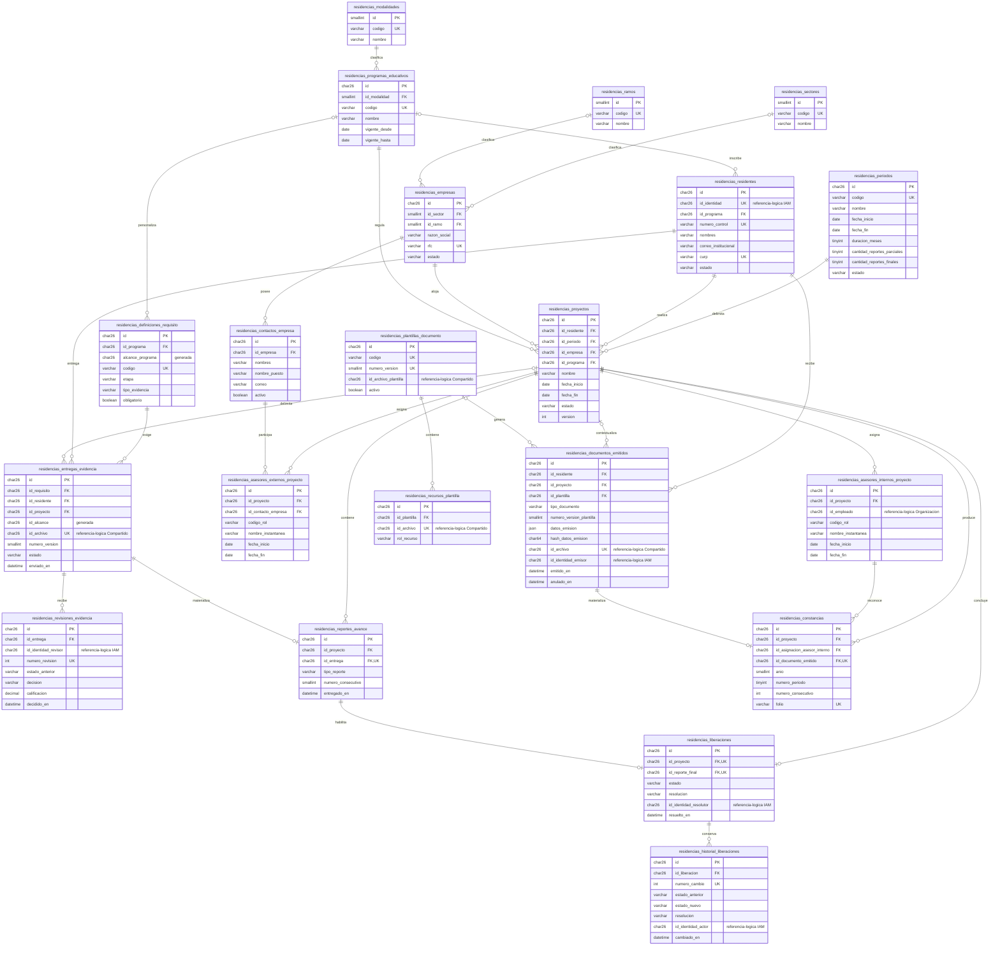
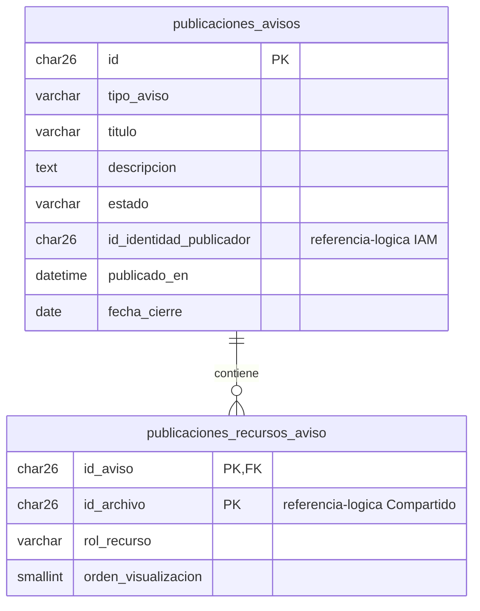
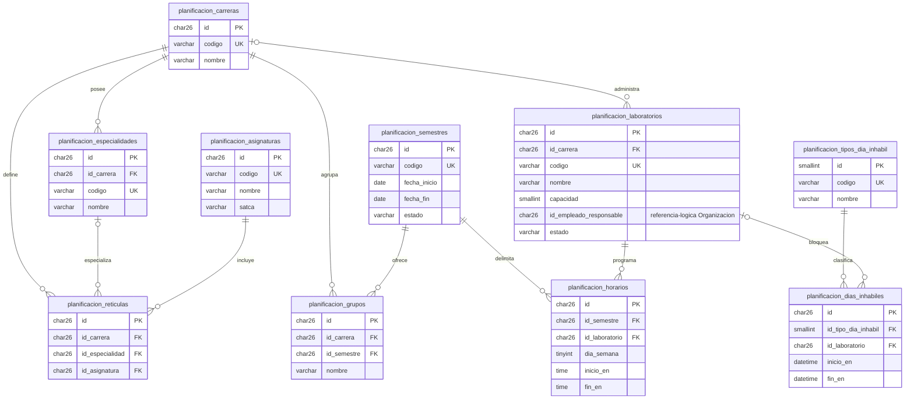
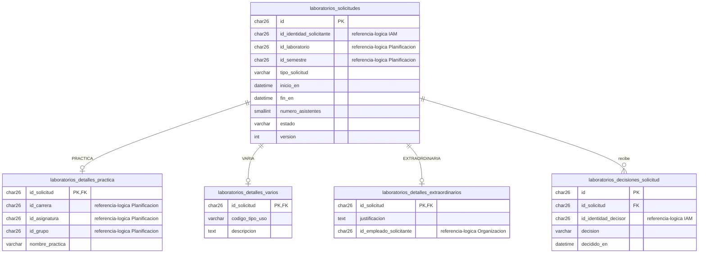

# Propuesta de base de datos — modelo ER objetivo

Fecha: 2026-09-05 · Última actualización: 2026-09-06  
DDL ejecutable: [`../database/mysql/001_create_servicios_moderno.sql`](../database/mysql/001_create_servicios_moderno.sql)  
Análisis y decisiones: [Análisis de bases de datos y modernización](./ANALISIS_BASE_DATOS_MODERNIZACION.md)

## Evidencia legacy recuperada


El PNG anterior representa el diseño legacy recuperado. Los diagramas siguientes describen la propuesta nueva; no son una transcripción uno a uno.

## Convenciones

- La base nueva se llama `servicios_moderno`.
- Tablas, columnas, índices, restricciones, estados y permisos de negocio se nombran en español para conservar el lenguaje ubicuo y facilitar la correlación con el esquema anterior.
- Las PK de negocio nuevas son ULID en `CHAR(26)`; catálogos pequeños usan enteros.
- Las FK se aplican dentro de cada bounded context.
- Una columna marcada como `referencia-logica` apunta conceptualmente a otro contexto, pero no tiene FK física.
- Los archivos se referencian por `id_archivo`; el binario vive en storage, no dentro de MySQL.
- Los instantes se almacenan en UTC como `DATETIME(6)`.
- Las tablas `compartido_mensajes_salida`, `compartido_registros_auditoria` y `migracion_mapa_ids` sostienen integración, trazabilidad y migración.

## Vista de contextos



## ER — Compartido e IAM

```mermaid
erDiagram
    iam_identidades {
        char26 id PK
        varchar nombre_mostrado
        varchar correo_normalizado UK
        varchar estado
        datetime ultimo_acceso_en
    }
    iam_cuentas_externas {
        char26 id PK
        char26 id_identidad FK
        varchar proveedor
        varchar id_inquilino
        varchar sujeto_proveedor UK
        varchar nombre_principal
        json instantanea_atributos
    }
    iam_roles {
        char26 id PK
        varchar codigo UK
        varchar nombre
    }
    iam_permisos {
        char26 id PK
        varchar codigo UK
        text descripcion
    }
    iam_identidad_roles {
        char26 id_identidad PK,FK
        char26 id_rol PK,FK
        char26 id_identidad_otorgante FK
        datetime expira_en
    }
    iam_rol_permisos {
        char26 id_rol PK,FK
        char26 id_permiso PK,FK
    }
    compartido_archivos_almacenados {
        char26 id PK
        varchar disco
        varchar clave_objeto UK
        varchar tipo_mime
        bigint tamano_bytes
        char64 sha256
        varchar estado_escaneo
        char26 id_identidad_carga "referencia-logica"
    }
    compartido_mensajes_salida {
        char26 id PK
        varchar nombre_contexto
        varchar tipo_agregado
        char26 id_agregado
        varchar tipo_evento
        json contenido
        datetime ocurrido_en
        datetime publicado_en
    }
    compartido_claves_idempotencia {
        varchar alcance PK
        varchar clave_idempotencia PK
        char64 hash_solicitud
        datetime expira_en
    }
    compartido_registros_auditoria {
        bigint id PK
        char26 id_identidad_actor "referencia-logica"
        varchar nombre_contexto
        varchar accion
        varchar tipo_sujeto
        varchar id_sujeto
        char36 id_correlacion
    }
    compartido_politicas_retencion {
        char26 id PK
        varchar codigo UK
        varchar nombre
        smallint meses_archivo_circular
        smallint meses_archivo_historico
        smallint meses_para_depurar
        boolean depuracion_automatica
        boolean activo
    }
    compartido_registros_retencion {
        char26 id PK
        char26 id_politica_retencion FK
        varchar nombre_contexto UK
        varchar tipo_sujeto UK
        varchar id_sujeto UK
        date fecha_referencia
        date fecha_archivo_circular
        date fecha_archivo_historico
        date fecha_depurable
        varchar estado_retencion
        boolean bloqueo_legal
    }
    migracion_mapa_ids {
        bigint id PK
        varchar base_origen UK
        varchar tabla_origen UK
        varchar id_legacy UK
        varchar tabla_destino
        char26 id_destino
        char64 hash_origen
    }

    iam_identidades ||--o{ iam_cuentas_externas : posee
    iam_identidades ||--o{ iam_identidad_roles : recibe
    iam_roles ||--o{ iam_identidad_roles : asigna
    iam_roles ||--o{ iam_rol_permisos : otorga
    iam_permisos ||--o{ iam_rol_permisos : incluye
    iam_identidades o|--o{ iam_identidad_roles : otorgado_por
    compartido_politicas_retencion ||--o{ compartido_registros_retencion : regula
```



## ER — Organización



## ER — Residencias y evidencias



## ER — Publicaciones



## ER — Planificación académica



## ER — Solicitudes de laboratorio



La base garantiza como máximo un detalle por tipo mediante PK compartida. La regla “exactamente un detalle compatible con `tipo_solicitud`” pertenece a la transacción del agregado y se cubre con tests; no se puede expresar limpiamente con una FK estándar entre cuatro tablas.

## ER — Inventarios

```mermaid
erDiagram
    inventario_inventarios {
        char26 id PK
        char26 id_laboratorio UK "referencia-logica Planificacion"
        varchar estado
        datetime inicializado_en
        char26 id_identidad_inicializador "referencia-logica IAM"
    }
    inventario_ubicaciones {
        char26 id PK
        char26 id_inventario FK
        char26 id_padre FK
        char26 alcance_padre "generada"
        varchar nombre_normalizado UK
        varchar tipo_ubicacion
    }
    inventario_articulos {
        char26 id PK
        char26 id_inventario FK
        char26 id_ubicacion FK
        varchar tipo_articulo
        varchar codigo_inventario UK
        varchar nombre
        decimal cantidad
        varchar codigo_unidad
        varchar estado
        date fecha_caducidad
        int version
    }
    inventario_detalles_equipo {
        char26 id_articulo PK,FK
        varchar etiqueta_activo UK
        date fecha_proximo_mantenimiento
    }
    inventario_detalles_material {
        char26 id_articulo PK,FK
        decimal existencia_minima
        decimal punto_reorden
    }
    inventario_detalles_reactivo {
        char26 id_articulo PK,FK
        varchar numero_cas
        varchar clase_peligro
        varchar numero_lote
        decimal existencia_minima
    }
    inventario_detalles_software {
        char26 id_articulo PK,FK
        varchar tipo_licencia
        text clave_licencia_cifrada
        int numero_licencias
    }
    inventario_detalles_infraestructura {
        char26 id_articulo PK,FK
        varchar tipo_sistema
        text especificacion_tecnica
    }
    inventario_movimientos {
        char26 id PK
        char26 id_articulo FK
        char26 id_ubicacion_origen FK
        char26 id_ubicacion_destino FK
        varchar tipo_movimiento
        decimal variacion_cantidad
        char26 id_identidad_actor "referencia-logica IAM"
        datetime ocurrido_en
    }
    inventario_incidencias {
        char26 id PK
        char26 id_articulo FK
        char26 id_identidad_reportante "referencia-logica IAM"
        varchar severidad
        varchar estado
        datetime reportado_en
        datetime resuelto_en
    }
    inventario_politicas_abc {
        char26 id PK
        char26 id_inventario FK
        decimal umbral_a
        decimal umbral_b
        date vigente_desde
        date vigente_hasta
    }
    inventario_cortes_mensuales {
        char26 id PK
        char26 id_inventario FK
        char26 id_politica_abc FK
        char7 periodo UK
        varchar estado
        char64 hash_instantanea
    }
    inventario_detalles_corte_mensual {
        bigint id PK
        char26 id_corte FK
        char26 id_articulo
        varchar tipo_articulo_instantanea
        decimal cantidad_instantanea
        char1 clase_abc
        json datos_instantanea
    }
    inventario_permisos_acceso {
        char26 id PK
        char26 id_laboratorio UK "referencia-logica Planificacion"
        char26 id_identidad UK "referencia-logica IAM"
        varchar nivel_acceso
        boolean activo
    }
    inventario_documentos_laboratorio {
        char26 id PK
        char26 id_laboratorio "referencia-logica Planificacion"
        char26 id_archivo UK "referencia-logica Compartido"
        varchar tipo_documento
        smallint numero_version
    }

    inventario_inventarios ||--o{ inventario_ubicaciones : organiza
    inventario_ubicaciones o|--o{ inventario_ubicaciones : contiene
    inventario_inventarios ||--o{ inventario_articulos : owns
    inventario_ubicaciones o|--o{ inventario_articulos : almacena
    inventario_articulos ||--o| inventario_detalles_equipo : EQUIPO
    inventario_articulos ||--o| inventario_detalles_material : material
    inventario_articulos ||--o| inventario_detalles_reactivo : REACTIVO
    inventario_articulos ||--o| inventario_detalles_software : software
    inventario_articulos ||--o| inventario_detalles_infraestructura : INFRAESTRUCTURA
    inventario_articulos ||--o{ inventario_movimientos : registra
    inventario_ubicaciones o|--o{ inventario_movimientos : origen
    inventario_ubicaciones o|--o{ inventario_movimientos : destino
    inventario_articulos ||--o{ inventario_incidencias : presenta
    inventario_inventarios ||--o{ inventario_politicas_abc : configura
    inventario_inventarios ||--o{ inventario_cortes_mensuales : cierra
    inventario_politicas_abc o|--o{ inventario_cortes_mensuales : aplica
    inventario_cortes_mensuales ||--|{ inventario_detalles_corte_mensual : captura
```



La regla “exactamente un detalle coherente con `tipo_articulo`” también se protege dentro del agregado `InventoryItem` y su transacción.

## Reglas confirmadas que gobiernan el ER

- `residencias_empresas` es un catálogo global. Sus contactos son 0..n y una asignación histórica determina qué asesor externo participó en cada proyecto.
- `residencias_proyectos` es único por residente y periodo. El histórico en periodos distintos se conserva; el servicio de dominio impide fechas solapadas mediante transacción y bloqueo porque un `CHECK` de fila no puede comparar otros proyectos.
- `residencias_periodos` admite las duraciones confirmadas de 4, 5 y 6 meses: 2 parciales + 1 final para 4 meses; 3 parciales + 1 final para 5/6 meses.
- `residencias_revisiones_evidencia` y `residencias_historial_liberaciones` son historiales append-only. La última secuencia determina la decisión vigente y se escribe atómicamente con el estado materializado.
- `residencias_documentos_emitidos.datos_emision` congela todos los valores renderizados. La instantánea y su SHA-256 no se reescriben; una corrección genera una nueva emisión y, si procede, anula la anterior.
- `organizacion_asignaciones_puesto` permite 0..n puestos simultáneos y conserva el texto y orden derivados de Microsoft `JobTitle`.
- `compartido_politicas_retencion` parametriza 24/60/120 meses. El estado cambia a circular, histórico y depurable, pero la depuración es manual, autorizada y auditable por defecto.

## Relaciones lógicas entre contextos

| Columna | Referencia conceptual | Razón para no crear FK física |
|---|---|---|
| `organizacion_empleados.id_identidad` | `iam_identidades.id` | IAM y Organización tienen ciclos de vida independientes. |
| `residencias_residentes.id_identidad` | `iam_identidades.id` | Un residente puede existir antes de vincular su login. |
| `*_id_identidad` | `iam_identidades.id` | Auditoría debe sobrevivir a desactivación/archivo de identidad. |
| `id_empleado` en asesor interno | `organizacion_empleados.id` | Residencias conserva snapshot histórico del asesor. |
| `planificacion_laboratorios.id_empleado_responsable` | `organizacion_empleados.id` | Planificación consume una referencia publicada. |
| IDs académicos en detalles de solicitud | tablas `planificacion_*` | Una solicitud autorizada debe conservarse aunque cambie el catálogo. |
| `id_laboratorio` en solicitudes/inventarios | `planificacion_laboratorios.id` | Cada contexto controla su historial y disponibilidad. |
| `id_archivo` | `compartido_archivos_almacenados.id` | Storage es un port compartido y tiene políticas de retención separadas. |

Estas relaciones se validan al aceptar comandos y se sostienen mediante eventos/proyecciones. Los snapshots preservan el significado histórico.

## Orden de creación

El SQL crea las tablas en este orden:

1. infraestructura compartida;
2. IAM;
3. Organización;
4. Residencias y evidencias;
5. Publicaciones;
6. Planificación académica;
7. Solicitudes de laboratorio;
8. Inventarios;
9. política de retención y permisos estables iniciales.

Las relaciones físicas siempre apuntan a tablas ya creadas. Laravel debe asumir la generación de ULID antes de insertar; MySQL no genera automáticamente estas claves.

## Ejecución del DDL

Requisitos:

- MySQL 8.0.16 o superior;
- una instancia donde `servicios_moderno` todavía no exista;
- una cuenta autorizada para `CREATE DATABASE` y `CREATE TABLE`;
- timezone de aplicación y sesiones de escritura configurado en UTC.

Ejecutar desde la raíz del repositorio:

```powershell
mysql --default-character-set=utf8mb4 -u <usuario> -p < database/mysql/001_create_servicios_moderno.sql
```

El script falla intencionalmente si `servicios_moderno` ya existe para evitar mezclar el baseline con un esquema parcial. No debe ejecutarse directamente en producción antes de probar backup/restauración y creación completa en un ambiente desechable.

Comprobación posterior:

```sql
USE servicios_moderno;
SELECT COUNT(*) AS tablas
FROM information_schema.tables
WHERE table_schema = 'servicios_moderno' AND table_type = 'BASE TABLE';
```

El baseline contiene **71 tablas**. Laravel agregará después su tabla `migrations` mediante sus propias migraciones.


