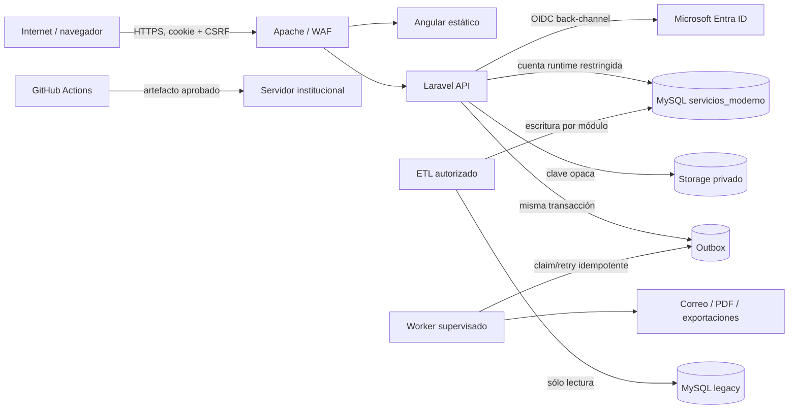

# Modelo de amenazas y baseline de seguridad

Este documento modela la arquitectura objetivo, no declara vulnerabilidades confirmadas. Los escenarios son hipótesis que deben convertirse en casos de prueba y controles verificables. La revisión arquitectónica se realizó de forma secuencial contra las fuentes de verdad y el diseño de implementación; no hubo una segunda revisión independiente porque la sesión no autoriza delegación.

## 1. Overview

### Uso y componentes

El despliegue objetivo sirve una SPA Angular pública/autenticada detrás de Apache, una API Laravel modular, workers/scheduler, MySQL `servicios_moderno`, storage privado, Entra ID y conexiones legacy exclusivamente de lectura durante la migración. Producción institucional es la fuente autoritativa y desarrollo sólo usa datos anonimizados (`docs/ANALISIS_BASE_DATOS_MODERNIZACION.md:537`).

| Componente | Función y datos sensibles | Evidencia de diseño |
|---|---|---|
| Angular | UI, formularios y estado no secreto; no conserva tokens | `docs/implementacion/ANGULAR.md:122` |
| Apache/TLS | terminación HTTPS, headers, routing strangler, límites | `docs/implementacion/ARQUITECTURA_LARAVEL.md:23` |
| Laravel Presentation/Application | autenticación, autorización, commands/queries y validación | `docs/implementacion/ARQUITECTURA_LARAVEL.md:341-353` |
| Módulos Domain | invariantes de residencia, reservas, inventario y publicación | `docs/implementacion/ARQUITECTURA_LARAVEL.md:29` |
| IAM/Entra | OIDC, sesión, provisioning, roles y policies | `docs/implementacion/IAM_ENTRA_ID.md:42` |
| MySQL nuevo | datos de negocio, historial, auditoría, idempotencia y outbox | `docs/ANALISIS_BASE_DATOS_MODERNIZACION.md:239` |
| Legacy MySQL | cuatro orígenes read-only durante ETL/convivencia | `docs/implementacion/ARQUITECTURA_LARAVEL.md:360` |
| Storage privado | expedientes, plantillas, imágenes y emisiones | `docs/ANALISIS_BASE_DATOS_MODERNIZACION.md:290` |
| Worker/outbox | efectos posteriores al commit, notificaciones y proyecciones | `docs/ANALISIS_DDD_MIGRACION.md:386` |
| GitHub Actions/deploy | compila, prueba, firma/promueve artefactos y ejecuta migraciones | Diseño de `PLAN_EJECUCION.md`; implementación pendiente. |

### Flujo y zonas de confianza

### Recursos efectivos que deben resolverse en Sprint 0

| Deployment o workflow | Recurso/capacidad | Configuración y precedencia | Valor o ubicación efectiva segura | Lectores/escritores/destinatarios | Control que aplica | Evidencia o desconocido |
|---|---|---|---|---|---|---|
| Laravel web | secreto/certificado Entra | secret store → env runtime | referencia secreta, nunca archivo versionado | proceso PHP; Entra recibe prueba cliente | ACL secret store + rotación | proveedor de secretos aún no elegido |
| Laravel web | `APP_KEY` y claves de cifrado | secret store → env | referencia por ambiente | proceso PHP | acceso mínimo y rotación planificada | procedimiento de rotación pendiente |
| Laravel web | sesión | config Laravel → cookie/browser + store | cookie `Secure HttpOnly SameSite=Lax`; store privado | navegador y Laravel | Sanctum, CSRF, timeout | dominio final pendiente |
| Runtime DB | credencial `servicios_moderno` | env por ambiente | usuario sin DDL, sin legacy write | PHP/worker → MySQL | grants mínimos/TLS | grants deben probarse |
| ETL | cuatro credenciales legacy | secret store → comando | cuentas `SELECT` por schema | operador/runner ETL | red privada, grants y audit log | cuentas todavía no creadas |
| Upload | staging y storage final | `filesystems.php` → volumen/driver | fuera de `public`, claves opacas | Laravel/worker/backup | MIME, tamaño, AV, policy | NFS o S3 compatible pendiente |
| Telemetría | logs/traces/metrics | Monolog/OTLP → collector | sin tokens/PII/documentos | operación/SOC | redacción, RBAC y retención | backend/collector pendiente |
| CI/CD | secretos y artefactos | GitHub Environment → deploy | secretos por ambiente; artefacto por SHA | runner y host destino | approvals/OIDC/SSH restringido | mecanismo institucional pendiente |
| Migración | dumps/fixtures | extracción → staging | cifrado, temporal, checksum; desarrollo anonimizado | DBA/ETL autorizados | ACL, borrado verificado, manifiesto | ubicación temporal pendiente |

## 2. Threat Model, Trust Boundaries, and Assumptions

### Activos protegidos

- identidad `(tid, oid)`, sesiones, roles, permisos y alcances;
- datos personales de residentes/empleados y expedientes/documentos;
- integridad de proyectos, revisiones, liberaciones, folios y snapshots emitidos;
- disponibilidad y exclusión mutua de laboratorios;
- existencia, movimientos, valuación, incidencias y cierres de inventario;
- integridad/orden de auditoría, outbox, idempotencia y mapeo de migración;
- secretos Entra/DB/cifrado, binarios privados, backups y artefactos de despliegue;
- disponibilidad del servicio y capacidad de rollback/reconciliación.

### Objetivos/invariantes de seguridad

1. Autenticar sólo tokens OIDC válidos del tenant/audience permitidos y vincular por `(tid,oid)`, no por correo.
2. Autorizar cada acción y objeto en backend con permiso, alcance, ownership y estado; denegar por defecto.
3. Aceptar sólo campos DTO declarados; queries parametrizadas y salidas codificadas.
4. Mantener tokens fuera de JavaScript y secretos fuera de repo/logs/respuestas.
5. Tratar archivos como no confiables hasta validar tamaño, MIME real, hash y malware; nunca servirlos desde ruta pública.
6. Preservar atomicidad de agregado+historial+auditoría/outbox y controlar concurrencia.
7. Mantener snapshots, cierres e historiales append-only; toda depuración exige autorización y auditoría.
8. Hacer ETL repetible, sólo lectura en origen, reconciliado y sin datos productivos sin anonimizar en desarrollo.
9. Desplegar el mismo artefacto probado, con dependencias bloqueadas y migraciones gobernadas.
10. Fallar cerrado ante Entra, DB, storage, AV o policy indisponible cuando aceptar la operación comprometa integridad.

### Actores y capacidades iniciales

| Actor | Controla inicialmente | No se presume que controle |
|---|---|---|
| Anónimo remoto | rutas públicas, parámetros, headers, archivos enviados sólo si alcanza endpoint | sesión, red interna, Entra, servidor o DB |
| Usuario institucional | su navegador, inputs y una sesión válida con sus permisos | otro rol, otro residente/laboratorio, secrets o DB |
| Usuario privilegiado | acciones de su rol y alcance | administración IAM global, DBA o deploy salvo asignación explícita |
| Operador ETL/DB | ejecución aprobada y credenciales limitadas | Entra, CI o acceso indiscriminado a documentos salvo función |
| Proveedor externo comprometido | respuestas de Entra/Graph/correo/storage en su frontera | validación local ni host interno por defecto |
| Atacante de supply chain | paquete/action/artefacto comprometido si evade gates | secretos o producción si workflows están correctamente aislados |
| Administrador host malicioso | potencial acceso elevado al host | se reconoce como riesgo operacional; segregación y auditoría externa son controles compensatorios |

### Fronteras de confianza

| Frontera | Autoridad/dato transferido | Control esperado |
|---|---|---|
| Browser → Apache/Laravel | input no confiable, cookie, CSRF, uploads | TLS, límites, CSP, CSRF, validación, rate limit |
| Entra → callback IAM | assertions de identidad | state, nonce, PKCE, firma/JWKS, issuer, tenant, audience, tiempos |
| IAM → otros módulos | `IdentityRef`, permisos/eventos | published DTO, idempotencia, no modelos IAM |
| API → MySQL | comandos y consultas | usuario mínimo, SQL parametrizado, transacción, constraints |
| API → storage | binarios y claves | staging, allowlist MIME, AV, clave generada, policy de descarga |
| Command → worker | evento outbox y efecto externo | commit previo, claim atómico, retry, idempotencia/dead letter |
| ETL → legacy/nuevo | datos productivos y mapa ID | SELECT-only origen, normalización, checkpoint, checksum/reconciliación |
| CI → producción | artefacto, migraciones y autoridad de despliegue | protected environment, approvals, SHA, least privilege, rollback |
| Público → publicaciones | contenido renderizable/URL | sanitización, estado/vigencia, no acceso a expedientes |
| Admin → IAM/retención | grants y destrucción potencial | MFA/Conditional Access, permiso separado, motivo, doble control, auditoría |

### Supuestos, exclusiones y preguntas abiertas

- Supuesto proporcionado: no hay consumidores externos directos, triggers, procedures ni vistas; se reconfirma con grants/logs/`information_schema` antes del corte (`docs/ANALISIS_BASE_DATOS_MODERNIZACION.md:536-538`).
- Supuesto: Entra, Angular y API pueden operar bajo el mismo sitio registrable; si no, debe revisarse el patrón de sesión.
- Desconocidos: topología Apache/TLS/WAF, HA, driver de storage, antivirus, SMTP/Graph, collector OTLP, secret store, backup/PITR, RPO/RTO y volumen.
- Desconocido: conjunto exacto de claims/grupos/app roles y owner de su mapeo local.
- Desconocido: requisitos legales concretos de cifrado/tokenización para CURP/RFC/NSS y segregación del DBA.
- La amenaza interna con control total de host/DB no se resuelve sólo en aplicación; requiere segregación, logging externo, backups inmutables y procesos institucionales.
- Este modelo cubre la arquitectura objetivo y workflows de migración/deploy; no es una auditoría exhaustiva del código CodeIgniter ni confirma que controles futuros estén implementados.

## 3. Attack Surface, Mitigations, and Attacker Stories

### Historias priorizadas

| Prioridad | Escenario hipotético y capacidad obtenida | Prerrequisitos | Impacto | Controles diseñados | Mitigación/prueba requerida | Evidencia |
|---|---|---|---|---|---|---|
| P0 | BOLA/BFLA permite leer o mutar expediente, inventario o solicitud ajena | endpoint confía en ULID/guard UI | fuga PII, fraude o alteración institucional | Policies server-side con permiso+alcance | tests deny por endpoint/rol/ownership; ocultar 403/404 según política | `docs/implementacion/API_REST.md:131-161`, `docs/implementacion/IAM_ENTRA_ID.md:110` |
| P0 | Callback OIDC forjado/replay vincula cuenta del atacante a identidad legítima | state/nonce/claims mal validados | toma de cuenta | backend OIDC, `(tid,oid)`, session rotation | suite de tokens/codes negativos, allowlist tenant/redirect, librería mantenida | `docs/implementacion/IAM_ENTRA_ID.md:42-72` |
| P0 | Race autoriza dos reservas, dos proyectos solapados, revisión duplicada o stock negativo | requests concurrentes pasan validación previa | integridad de negocio | versionado, unique/check, transaction/locks | pruebas paralelas contra MySQL real y análisis de índices/locks | `docs/implementacion/ARQUITECTURA_LARAVEL.md:356` |
| P0 | Upload malicioso o path traversal ejecuta/sirve contenido activo | storage público, nombre cliente o MIME declarado | RCE, XSS almacenado, malware | storage privado, clave opaca, MIME/hash/AV | corpus seguro de archivos inválidos, no ejecutar conversores sin sandbox, descarga `nosniff`/attachment | `docs/ANALISIS_BASE_DATOS_MODERNIZACION.md:500-502` |
| P0 | Pipeline/paquete comprometido modifica artefacto o extrae secretos | action sin pin, PR no confiable con secrets, deploy mutable | compromiso producción/supply chain | lockfiles, environments, artefacto por SHA | actions por SHA, SBOM, SCA, branch protection, sin secrets en PR forks, firma/attestation si viable | OWASP A03/A08:2025 |
| P1 | XSS roba datos y ejecuta comandos con cookie de víctima | contenido dinámico/DOM inseguro; CSP débil | acciones y exfiltración con sesión | Angular escaping, CSP, Trusted Types, HttpOnly/CSRF | prohibir bypass, sanitizar Markdown, E2E CSP, dependencia DOM auditada | `docs/implementacion/ANGULAR.md:122-133` |
| P1 | Mass assignment/inyección altera campos internos o SQL | arrays directos, sort/filter/`catalog` interpolado | elevación, corrupción/exfiltración | DTO allowlist, parámetros y catálogos allowlist | SAST + tests propiedades desconocidas, filtros/orden maliciosos | `docs/implementacion/API_REST.md:16`, `docs/implementacion/API_REST.md:203` |
| P1 | Evento outbox duplicado/desordenado repite correo, grant o efecto | worker reintenta tras fallo parcial | efectos repetidos/inconsistencia | IDs/version, claim, consumers idempotentes | crash tests antes/después del efecto; métricas edad/retry/dead-letter | `docs/implementacion/adr/ADR-008-outbox.md:19` |
| P1 | ETL envenena o filtra datos productivos | dump sin cifrar, normalización ambigua, cuenta write legacy | PII expuesta/corrupción irreversible | origen read-only, staging, mapa IDs, hashes | dry-run, manifiesto, anonimización, reconciliación y aprobación por oleada | `docs/ANALISIS_BASE_DATOS_MODERNIZACION.md:429-456` |
| P1 | Documento emitido/historial se reescribe sin rastro | UPDATE directo o permisos DB excesivos | invalidez probatoria | snapshot+hash, append-only, grants mínimos | repositorio sin update, verificación periódica de hash, auditoría externa y backup | `docs/ANALISIS_BASE_DATOS_MODERNIZACION.md:532-533` |
| P1 | Depuración elimina expedientes fuera de alcance | permiso amplio, job sin dry-run/bloqueo legal | pérdida masiva/indisponibilidad | automática false, estados y bloqueo | dry-run firmado, alcance exacto, doble aprobación, backup/restauración ensayada | `docs/ANALISIS_BASE_DATOS_MODERNIZACION.md:535` |
| P1 | DoS agota PHP/DB/storage con lists, uploads, PDF/export o login | endpoint costoso sin límites | indisponibilidad/coste | cursor máximo, rate/size limits, jobs async | cuotas por actor/IP, timeouts, circuit breaker, límites workers y pruebas carga | `docs/implementacion/API_REST.md:10-14` |
| P2 | Servidor confía en respuesta Graph/URL externa y realiza SSRF o consume datos no válidos | fetch URL controlable/redirecciones | acceso a red interna o poisoning | endpoints fijos, TLS, DTO/mapeo ACL | allowlist hosts, bloquear redirects/destinos privados, timeouts y schema validation | OWASP API10:2023 |
| P2 | Logs/auditoría exponen tokens/PII o permiten log injection | input crudo, excepciones serializadas | fuga y pérdida de trazabilidad | redacción, JSON, correlationId | tests de redacción, normalizar CR/LF, acceso/retención separados, alertas | `docs/ANALISIS_BASE_DATOS_MODERNIZACION.md:503-504` |
| P2 | Configuración insegura expone debug, health, CORS o archivos | build/env incorrectos | información sensible/abuso | config cache y ambientes separados | `APP_DEBUG=false`, allowlists exactas, config tests y escaneo despliegue | OWASP A02:2025 |

### Mapeo OWASP Top 10:2025

| Categoría | Gate de implementación |
|---|---|
| A01 Broken Access Control | Policies de objeto/función, deny-by-default, tests BOLA por recurso, grants mínimos DB/storage. |
| A02 Security Misconfiguration | baseline Apache/PHP/Laravel, debug off, headers/CORS/health, config test por ambiente. |
| A03 Software Supply Chain Failures | lockfiles, Dependabot, SCA/SBOM, actions fijadas, artefacto inmutable y separación build/deploy. |
| A04 Cryptographic Failures | TLS, secret store, cifrado Laravel sólo para secretos necesarios, rotación y backup cifrado. |
| A05 Injection | DTO allowlist, Query Builder/bindings, escaping Angular, sin comandos shell con input. |
| A06 Insecure Design | threat model en cada epic, invariantes/concurrencia, abuse cases y límites de consumo. |
| A07 Authentication Failures | OIDC code flow, claims/state/nonce, sesión segura, Entra MFA/Conditional Access. |
| A08 Software or Data Integrity Failures | hashes de documentos/ETL/artefactos, outbox/idempotencia, snapshots append-only. |
| A09 Security Logging & Alerting Failures | audit semántico, logs JSON, alertas authz/auth/outbox/ETL, runbooks y correlationId. |
| A10 Mishandling of Exceptional Conditions | Problem Details sin fuga, fallar cerrado, timeouts/retries acotados, dead-letter y rollback. |

También es obligatorio cubrir [OWASP API Security Top 10 2023](https://owasp.org/API-Security/), especialmente BOLA, broken authentication, property/function authorization, resource consumption, inventory de endpoints y consumo inseguro de Entra/Graph/storage.

### Hardening Laravel/PHP/Apache

- `APP_ENV=production`, `APP_DEBUG=false`; secretos fuera de `.env` versionado y configuración cacheada.
- PHP soportado, `display_errors=Off`, límites de memoria/upload/ejecución, OPcache; deshabilitar funciones no usadas según compatibilidad.
- Apache sólo publica `public/`, niega dotfiles/backups/config, HTTPS+HSTS tras validación, CSP, `frame-ancestors`, `nosniff`, Referrer/Permissions Policy.
- Cookies seguras, session rotation/timeouts, CSRF, CORS origins exactos y trusted proxies explícitos.
- Form Requests y DTO estrictos; Policies en todas las rutas; route model binding nunca equivale a autorización.
- Query Builder/Eloquent parametrizado; allowlist para sort/filter/catalog; no SQL dinámico con identificadores de usuario.
- Rate limits separados para login/callback, públicos, upload, export, revisión, decisiones y depuración.
- Storage privado, filename generado, MIME por contenido, tamaño, SHA-256, AV y descarga autorizada con `Content-Disposition`/`nosniff`.
- Workers con usuario OS no privilegiado, timeouts, memoria, reintentos acotados y supervisor; jobs serializan IDs/DTO, no secretos/modelos completos.
- Runtime DB sin DDL; migrator separado; legacy `SELECT` únicamente; TLS y backup/PITR probado.
- No deserialización PHP insegura, `eval`, comandos shell con input ni fetch a URL proporcionada por usuario.

### Hardening Angular

- build producción/AOT, strict mode y presupuestos; source maps sólo en repositorio de observabilidad protegido.
- CSP y Trusted Types en enforcement; no `unsafe-eval`; reducir/eliminar `unsafe-inline` mediante nonces/hashes.
- evitar `innerHTML` y `bypassSecurityTrust*`; sanitizar contenido enriquecido con allowlist.
- no tokens/PII persistentes en storage del navegador ni logs; runtime config sin secretos.
- dependencias y lockfile auditados; no scripts de terceros sin necesidad, SRI/CSP cuando apliquen.
- guards sólo UX; backend autoriza. No confiar en permisos cacheados para ejecutar comandos.
- manejar 401/403/409/422/429/503 explícitamente; no retries infinitos ni reenvío automático de commands.

Fuente de controles frontend: [seguridad oficial Angular](https://angular.dev/best-practices/security). Fuente de categorías: [OWASP Top 10:2025](https://owasp.org/Top10/2025/0x00_2025-Introduction/).

## 4. Severity Calibration (Critical, High, Medium, Low)

| Severidad | Ejemplo dentro de este sistema | Qué la reduce o excluye |
|---|---|---|
| Critical | toma de cuentas administrativas a distancia o ejecución remota preautenticación con alcance general; borrado irreversible de toda producción y backups accesibles | requiere camino demostrable, sin privilegio previo y con control efectivo ausente; hipótesis sin despliegue alcanzable no basta |
| High | BOLA masiva de expedientes, bypass de autorización para liberar residentes/autorizar laboratorios, modificación de cierres/snapshots, extracción de secretos de deploy | alcance aislado, policy efectiva, read-only, rate limit o aprobación pueden bajar probabilidad/impacto |
| Medium | XSS almacenado limitado a rol/alcance, fuga acotada de metadata, DoS recuperable de un worker, repetición idempotente imperfecta | CSP/Trusted Types, redacción, cuotas, retry y aislamiento de worker pueden reducirlo |
| Low | información técnica menor sin secreto, abuso self-only reversible, falta de header sin exploit material | no elevar sólo por incumplimiento de best practice; debe existir capacidad nueva concreta |

La severidad describe impacto demostrado y alcance; la confianza describe evidencia. Un escenario P0 no es automáticamente una vulnerabilidad Critical. Los desconocidos de red, secrets, AV, backup y CI permanecen preguntas hasta inspeccionar el despliegue efectivo. El control declarado en estos documentos tampoco cuenta como implementado hasta que CI, pruebas o configuración desplegada lo demuestren.
